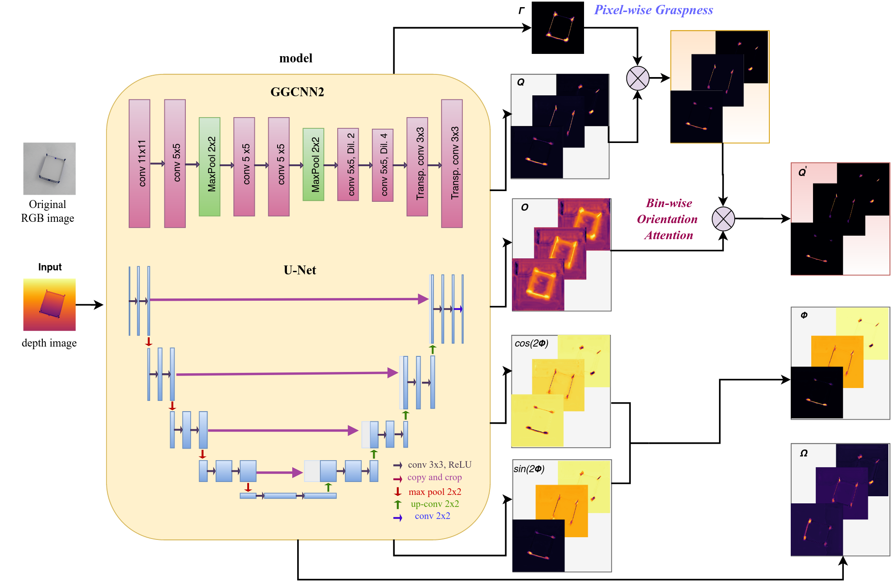

# ORANGE
(under development)

This repository contains the code release for the paper: 
''Orientation Attentive Robot Grasp Synthesis'', 
currently under review for IROS 2020 

 **Abstract:** 
Physical neighborhoods of grasping points in common objects may offer a wide variety of plausible grasping configurations. For a fixed center of a simple spherical object for example, there is an infinite number of valid grasping orientations. Such structures create ambiguous and discontinuous grasp maps that confuse neural regressors. We perform a thorough investigation on the challenging Jacquard dataset to show that the existing pixel-wise learning approaches are prone to box overlaps of drastically different orientations. We then introduce a novel augmented map representation that partitions the angle space into bins to allow for the co-occurrence of such orientations and observe larger accuracy margins on the ground truth grasp map reconstructions. On top of that, we build the ORientation AtteNtive Grasp synthEsis (ORANGE) framework that jointly solves a bin classification problem and a real-value regression. The grasp synthesis is attentively supervised by combining discrete and continuous estimations into a single map. We provide experimental evidence by appending ORANGE to two existing unimodal architectures and boost their performance to state-of-the-art  levels on Jacquard, specifically 94.71\%, over all related works, even multimodal.

 

